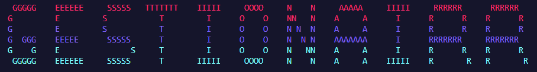

**GESTIONAIRR est une application console dédiée à la gestion des produits et la manipulation de leurs informations en utilisant le langage C et la gestion de fichiers**


### Installation
---

**Conditions**

Vous devez disposer d'un compilateur des fichiers .c pour être apte à installer et Configurer se projet dans votre ordinateur.

#### Cloner

Cloner le répertoire vers votre dossier local.

```console
 ~$ git clone https://github.com/BUSHIWAY/Gestion-de-Stock.git
```

#### Compiler

Compiler les fichiers .c pour avoir un fichier executable.

```console
  ~$ gcc Functions/Affichage.c Functions/Extract.c Functions/Insert.c Functions/Ajout_List.c Functions/Suppression_List.c Functions/Search.c Functions/Edit.c Functions/Sort.c -o app GESTIONRR.c
```
#### Executer

Executer le fichier .exe.

```console
  ~$ app.exe
```

### Usage
---


### Details
---

- **GESTIONAIRR** est application Console sert à stocker une liste de produit dans un fichier stock.txt trouvé dans un dossier Stock.

- Au cas où vous voulez travailler avec votre fichier de stock, il doit être sous cette forme :


**Toute autre forme, le programme va malfonctionner!**

- L'application utilise le concept des listes doublement chaînées circulaires pour manipuler les données du fichier.

- Elle extrait les données du fichier en utilisant la fonction "Extract" qui ouvre le fichier et puis remplir la liste chaînée "products".

- Après que l'utilisateur sort du programme les modifications appliquées sur "products" vont être insérer au fichier "stock.txt".

- L'application offre à l'utilisateur 6 fonction principale :
1. L'Affichage des données des produits de la liste.
2. L'ajout d'un produit à la liste.
3. La suppression d'un produit de la liste.
4. La modification d'une donné d'un produit de la liste.
5. La recherche d'un produit de la liste.
6. Le triage de la liste.


### Affichage
---

En utilisant la commande "A" ou "a".

#### Ajout 
---

il existe 3 choix d'ajout :
- **Ajout au debut**: En utilisant la commande "1".
- **Ajout à la fin**: En utilisant la commande "2".
- **Ajout à une position donnée**: En utilisant la commande "3".

#### Suppression 
---

il existe 3 choix d'ajout :
- **Suppression au debut**: En utilisant la commande "4".
- **Suppression à la fin**: En utilisant la commande "5".
- **Suppression à une position donnée**: En utilisant la commande "6".

#### Modification 
---

En utilisant la commande "7".

#### Recherche 
---

il existe 2 choix d'ajout :
- **La recherche avec le nom du produit**: En utilisant la commande "8".
- **La recherche avec le nom de l'utilisateur du produit**: En utilisant la commande "7".

#### Triage
---

il existe 2 choix d'ajout :
- **Triage par le nom du produit**: En utilisant la commande "N" ou "n".
- **Triage par le prix du produit**: En utilisant la commande "P" ou "p".

---
**Have fun using it!!** :joy: